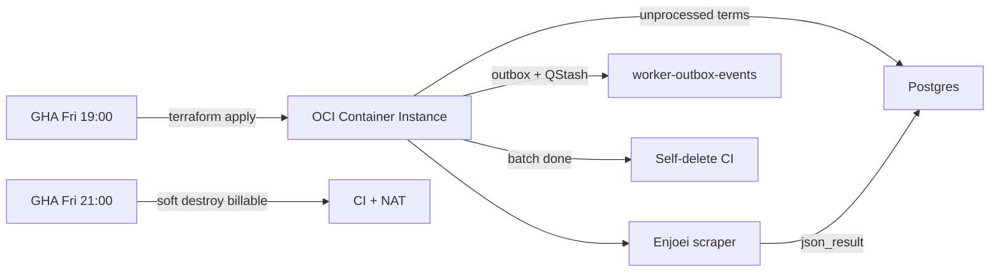

# Robot Scrape Products

Ephemeral **CRON robot** for SkyDIIV automatic thrifting. It exists only while
there is work to do: a weekly GitHub Actions job creates an **OCI Container
Instance** from an OCIR image, the robot reads unprocessed
`search_terms_scraped_products` from Postgres, scrapes marketplace listings,
writes `results_search_terms_scraped_products`, enqueues
`analyze-scraped-products-results` via the outbox, and then deletes its own
instance.

It does **not** drain Cloudflare Queues, write `scraped_products`, or set web
Redis shopping-suggestions keys.

Env: [docs/ENV.md](docs/ENV.md) · Deploy: [deploy/README.md](deploy/README.md)

## Weekly job

| Step | What it does |
|---|---|
| Load unprocessed terms | Grouped by `wardrobe_panorama_id` |
| Scrape | Enjoei, up to 10 listings per search term, each with its size confirmed on the listing page ([ENJOEI_SCRAPING.md](docs/ENJOEI_SCRAPING.md)) |
| Persist | `json_result` rows + mark terms `is_processed` |
| Outbox | One `analyze-scraped-products-results` row per panorama, then QStash `{ outboxEventId }` to `{WORKER_OUTBOX_EVENTS_URL}/process-outbox-event` |
| Exit | Self-delete the Container Instance |

## Lifecycle — how the robot is turned on and off

There is no long-running server to start or stop. The unit of on/off is the
Container Instance itself: **on = create it**, **off = delete it**. The
container never restarts (`container_restart_policy = NEVER`), so the process
runs exactly once per instance.

### Turning it on

| Trigger | How | Result |
|---|---|---|
| **Weekly (normal)** | GHA `Weekly — Robot Scrape Products`, cron `0 22 * * 5` (Fri 19:00 BRT) | lint/test/build → push OCIR image → cost gate → `terraform apply` |
| **Manual** | Same workflow, `workflow_dispatch` with `action=create` | Same as weekly |
| **From your machine** | `./deploy/deploy-from-local.sh apply` | Same stack, local Terraform state |
| **Local process only** | `docker compose up --build` or `npm run dev` | No cloud infra; scrapes unprocessed search terms once |

The container starts scraping as soon as the image is pulled — there is no
readiness gate or idle state.

### Turning it off

| Path | Trigger | Scope |
|---|---|---|
| **Self-delete** (normal) | Batch finished (or nothing to scrape) | Deletes the Container Instance; compute billing stops. Free VCN/IAM stay. |
| **Weekly destroy** (soft) | GHA cron `0 0 * * 6` (Fri 21:00 BRT), or `workflow_dispatch action=destroy` | Soft destroy — CI + NAT only; keeps free IAM/budget/VCN, **even if scrape work remains** |
| **Hard destroy** | `workflow_dispatch action=hard-destroy` only | Full stack teardown including free IAM/budget/VCN |
| **From your machine** | `./deploy/deploy-from-local.sh destroy` · `--hard` for full | Soft by default; `--hard` matches hard-destroy |
| **Cost guard** (safety net) | Daily 12:00 UTC, MTD spend ≥ `$5` | Hard destroy full stack, and refuses the next apply |
| **Local process** | `Ctrl-C` / `docker compose down` | `SIGINT`/`SIGTERM` finish in-flight work, then exit |

Self-delete only works from `ACTIVE`, and a short scrape can finish before OCI
promotes the instance out of `CREATING`. The robot therefore waits for `ACTIVE`
and lingers `SELF_DELETE_ACTIVE_GRACE_MS` (default 120s) so the in-flight
`terraform apply` sees `ACTIVE` too — details in
[deploy/README.md](deploy/README.md#self-delete-vs-destroy).

If self-delete fails, the 21:00 destroy still tears everything down; if that
also fails, the cost guard does. No single failure leaves compute billing
forever.

## Architecture

```
src/
├── domain/           # Entities, ports
├── infrastructure/   # Postgres, QStash outbox publish, Camoufox, OCI self-delete
├── presentation/     # ScrapeProductsBatchRunner
└── main.ts           # Composition root — weekly search-terms batch
```



## Tech stack

| Piece | Choice |
|---|---|
| Runtime | Node.js 22 |
| Mode | Weekly batch CRON (not a long-runner) |
| Trigger | Unprocessed `search_terms_scraped_products` rows |
| Browser | Camoufox + Playwright |
| Validation | Zod |
| Tests | Vitest |
| Infra | Terraform (ephemeral OCI Container Instance + VCN) + OCIR |
| Deploy | Weekly GHA create (Fri 19:00 BRT) / soft destroy (Fri 21:00 BRT) |

## Getting started (local)

```bash
cd apps/robot-scrape-products
cp .env.example .env
# Required: QSTASH_TOKEN, WORKER_OUTBOX_EVENTS_URL (origin only), DATABASE_URL
chmod +x scripts/*.sh
```

```bash
docker compose up --build   # container
npm install && npm run dev  # host
```

Either way the robot processes unprocessed search terms once and exits;
self-delete is a no-op without OCI credentials.

## Configuration

Full reference in [docs/ENV.md](docs/ENV.md). Most-used values:

| Variable | Default | Description |
|---|---|---|
| `QSTASH_TOKEN` | _(required)_ | Publish `{ outboxEventId }` to worker-outbox-events |
| `WORKER_OUTBOX_EVENTS_URL` | _(required)_ | worker-outbox-events origin only (no path) |
| `ROBOT_CONCURRENCY` | `2` | Max parallel search terms inside a panorama |
| `DATABASE_URL` | _(required)_ | Postgres |
| `WEB_APP_REDIS_REST_*` | _(optional, unused)_ | Web-app Redis is not written by this robot |
| `COMPUTE_PROVIDER` | auto | `oci` self-delete, `noop` locally |

## Tests

```bash
npm run test
npm run test:coverage
npm run lint
```

## Docs

- [Enjoei scraping](docs/ENJOEI_SCRAPING.md) — search URL filters, size confirmation, DOM contract
- [Environment files](docs/ENV.md)
- [Deploy & infrastructure](deploy/README.md)
