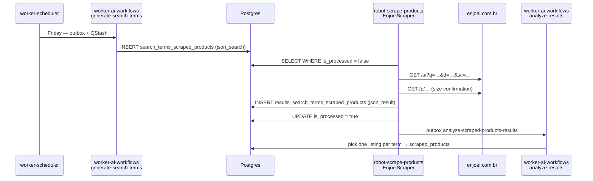
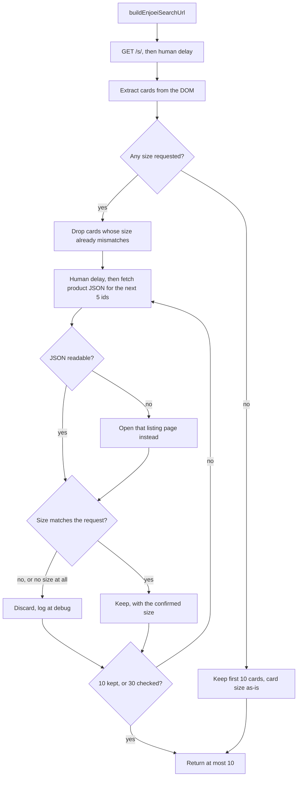

# Enjoei scraping

How SkyDIIV turns one `search_terms_scraped_products` row into at most 10 Enjoei
listings whose size the user actually wears.

This document has two halves. **Part 1** describes Enjoei itself — its page
surfaces, its search backend, and the query-string contract the robot depends
on. **Part 2** describes the SkyDIIV implementation that sits on top of it. Read
Part 1 first: almost every design decision in Part 2 is a reaction to something
in Part 1.

Env: [ENV.md](./ENV.md) · Robot overview: [../README.md](../README.md) ·
Downstream: [analyze-scraped-products-results](../../worker-ai-workflows/docs/ANALYZE_SCRAPED_PRODUCTS_RESULTS.md)

Source:

- `src/infrastructure/scraping/marketplaces/enjoei-search-url.ts` — URL + size/department/brand rules, listing-id parsing
- `src/infrastructure/scraping/marketplaces/enjoei.scraper.ts` — navigation + the three browser-side scripts

---

## Where this fits in the pipeline

Enjoei scraping is one stage of SkyDIIV automatic thrifting. It does not decide
*what* to search for, and it does not decide *which* listing the user finally
sees — it only turns a search request into candidate listings.



| Stage | Owner | Contract |
|---|---|---|
| Search terms are invented | `worker-ai-workflows` (LLM) | Writes `json_search` |
| Search terms become listings | **this robot** | Reads `json_search`, writes `json_result` |
| Listings become suggestions | `worker-ai-workflows` (LLM) | Picks ≤1 listing per term into `scraped_products` |

The robot's job is therefore *recall with a hard correctness constraint*: give
the downstream LLM a pool of plausible listings, and never put a listing in that
pool that the user cannot wear.

---

# Part 1 — The Enjoei marketplace

Enjoei (`enjoei.com.br`) is a Brazilian consumer-to-consumer marketplace, mostly
second-hand fashion. Each listing is a **single physical item** posted by an
individual seller, which has three consequences that shape everything below:

1. **One listing has exactly one size.** There is no size-variant selector, so
   "does this fit the user" is a single scalar comparison, not a stock lookup.
2. **Listings are ephemeral.** A listing sold today is gone tomorrow, so results
   cannot be cached across weeks and re-verified later.
3. **Metadata is seller-authored.** Titles are free text (`"bermuda masculina uvx
   jeans branca 40"`), so the title is not a trustworthy source for size, brand,
   or gender. Only the structured fields are.

## Page surfaces

| Surface | URL shape | Role |
|---|---|---|
| Search feed | `https://www.enjoei.com.br/s/?q=…` | Filtered result grid, ~30 cards per page |
| Listing page | `https://www.enjoei.com.br/p/{slug}-{id}` | One item; authoritative structured fields |
| Photos CDN | `https://photos.enjoei.com.br/public/{w}x{h}/{photoId}` | Resizable image URLs |
| Search backend | `https://enjusearch.enjoei.com.br/graphql` | The GraphQL API the feed hydrates from |
| Listing JSON | `https://pages.enjoei.com.br/products/{id}/v2.json` | Undocumented JSON view of a listing — **where sizes are confirmed** |

The numeric suffix on a listing URL is the product id (`…-branca-40-149242785`
→ `149242785`), and it is the key for the JSON endpoint. The rest of the path is
a human-readable slug that carries no meaning for lookups — including when it
ends in digits of its own, which is why only the final `-digits` group is the id.

## The search page is a client-rendered shell

`GET /s/` returns a **Vue SPA template, not results**. The server response
contains the filter widgets and an empty card template; the feed itself is
fetched by the browser from `enjusearch.enjoei.com.br/graphql` after hydration.

This is directly observable in the server HTML: the class name
`c-product-card` appears (as template markup), but the data attributes that
carry actual product text — `data-test="div-nome-prod"` and friends — appear
**zero** times until JavaScript runs.

The same is true of the listing page, and more severely: a fetch of
`/p/bermuda-masculina-uvx-jeans-branca-40-149242785` contains no
`product-size-value`, no `l-info-box`, and not even the word `tamanho`. **The
size is not in the server HTML at all.**

Two conclusions follow, and they are the reason this robot drives a real browser
rather than issuing HTTP requests:

- An HTML fetch of a search URL cannot tell you whether the filters matched.
- An HTML fetch of a listing cannot tell you its size.

## The listing JSON, and the CORS rule that shapes how it is used

`pages.enjoei.com.br/products/{id}/v2.json` returns a listing as structured
JSON, including the field the size confirmation needs:

```json
{
  "id": 149242785,
  "title": "bermuda masculina uvx jeans branca 40",
  "size": "40",
  "used": true,
  "brand": { "name": "uvx", "slug": "uvx", "verified": true },
  "fallback_pricing": { "price": { "listed": 42 } },
  "photos": ["czM6Ly9waG90b3MuZW5qb2VpLmNvbS5ici9wcm9k…"],
  "category_slug": "masculino-roupas-shorts-e-bermudas-outros"
}
```

It is undocumented, unversioned past the `v2` in its path, served through
Cloudflare with `cache-control: public,max-age=60`, and it needs no
authentication or `User-Agent`. Its observed behaviors:

| Case | Response |
|---|---|
| Listing exists, size set | `200`, `"size": "40"` |
| Listing exists, no size set | `200`, `"size": null` — the **key is present** |
| No such listing | `404`, empty body |

The distinction in the middle row is what makes this endpoint safe to depend on.
A listing with no size answers with `size: null`, so "this listing has no size"
and "this response no longer has a size field" are separable — see
[Size confirmation](#size-confirmation) for how that drives the fallback.

**The CORS policy decides where the fetch has to run.** The endpoint answers:

```
access-control-allow-origin: https://www.enjoei.com.br
```

That is a fixed allowlist, not a reflection of the caller: a request carrying
any other `Origin` gets `access-control-allow-origin: null`. So a browser can
only read this endpoint from a page already on `www.enjoei.com.br` — which the
search results page is. That single header is why the robot fetches listing
JSON from *inside* the search page rather than from Node.

Photo ids are base64-encoded `s3://` paths, composed into CDN URLs as
`photos.enjoei.com.br/public/{w}x{h}/{photoId}`. The robot does not use them —
it takes image URLs from the cards, which are already resolved.

## The filter contract

Enjoei parses the search query string **client-side** into GraphQL filter
arguments, using an abbreviation table that it ships in the page markup itself,
on the `product-feed` component as `abbr-params-map`. That table is the closest
thing to an API contract Enjoei publishes, and it is worth reading in full
because it explains several traps.

| Filter | Param | Filter | Param |
|---|---|---|---|
| `query` | `q` | `price_min` / `price_max` | `pg` / `pl` |
| `brands` | `b` | `used` | `u` |
| `store_kind` | `sk` | `promotion_slug` | `p` |
| **`department`** | **`d`** | `seller_segmentation` | `sls` |
| `sub_categories` | `s` | `last_published_at` | `lp` |
| `size_types` | `st` | `published_before` | `pb` |
| **`clothes`** | **`sc`** | `sort` | `o` |
| **`waist`** | **`sw`** | `current_page_cursor` | `cc` |
| **`shoes`** | **`ss`** | `previous_pages_cursors` | `pc` |
| `shipping_range` | `sr` | `discount_percentage_min` / `_max` | `dg` / `dl` |
| `plan_id` | `pp` | `search_id` | `sid` |
| **`recommendation_department`** | **`dep`** | `recommendation_category` | `cat` |
| `recommendation_sub_category` | `sub` | `recommendation_segment` | `seg` |
| `refid` | `refid` | `action_source` | `action_source` |
| `sales_propensity_tier` | `spt` | | |

Bolded rows are the ones that matter to this robot. Multi-value filters are
expressed by **repeating** the param — `?sc=m&sc=g`, never `?sc=m,g`.

### Departments

The `d` param scopes the feed to a department. Both the current slugs and
Enjoei's legacy aliases still resolve:

| Current | Legacy alias | Meaning |
|---|---|---|
| `feminino` | `mocas` | Women |
| `masculino` | `rapazes` | Men |
| `infantil` | `kids` | Children |

### Size types

Sizes are not one filter but three, split by garment family. Enjoei's own
labels for them (from the same markup) make the split unambiguous:

| Param | Filter | Covers |
|---|---|---|
| `sc` | `clothes` | camisas, camisetas, blusas… (tops) |
| `sw` | `waist` | calças, bermudas, shorts… (bottoms) |
| `ss` | `shoes` | sapatos, botas, tênis… (footwear) |

Enjoei varies these labels per department — `shoes` reads "sandálias,
rasteirinhas, sapatos…" under `feminino` and "sapatinhos, tênis, sandálias…"
under `infantil` — but the params and the garment families they select are the
same.

`clothes` sizes are lettered or numeric (`pp`, `p`, `m`, `g`, `gg`, `xgg`,
`unico`, `36`, `38`, `40`, …). `waist` and `shoes` are numeric. Note that `xg`
and `xgg+` do **not** exist as options, despite being common in Brazilian
sizing generally.

### Slug matching is exact, and failure is silent

Size and department values are matched against Enjoei's own option slugs, and
**an unrecognized slug returns an empty feed rather than being ignored.** There
is no error, no warning, and no "filter dropped" fallback — a typo looks exactly
like "nothing for sale in this size".

Normalization therefore has to be exact:

| Requirement | Example |
|---|---|
| Lowercase | `M` → `m` (`sc=M` returns nothing) |
| Unaccented | `Único` → `unico` |
| Numeric sizes verbatim | `40` → `40` |

### The `dep` trap

`dep` is **not** the department filter. In Enjoei's table `dep` is
`recommendation_department` — a recommendation/analytics parameter. It appears
all over Enjoei's own internal links (listing breadcrumbs use
`/masculino/s?dep=masculino`), which makes it look authoritative, but it does
not filter the feed.

Sending the user's gender as `dep` leaves the search **unscoped**, so a women's
search also returns men's and children's listings. That is not merely noisy: it
is actively wrong, because numeric sizes are department-relative. A men's waist
40 is not a women's 40, and a child's 40 is neither. This was the original cause
of wrong-size shopping suggestions, fixed by moving the gender to `d`.

### Ranking and other implicit defaults

Two defaults apply whether or not you ask for them:

- **Sort.** `o` (`sort`) is empty by default, which Enjoei labels *"mais
  relevantes"*. The other options are `low_price`, `high_price`, and
  `high_discount`. The robot sends no `o`, so everything it reads is relevance-ranked.
- **Location.** `sr` (`shipping_range`) has options `same_city`, `same_state`,
  `near_regions`, `same_country`, and Enjoei seeds it from the **caller's IP
  geolocation**. A non-Brazilian egress IP can therefore produce an empty feed
  for every term, with no other symptom. This matters for proxy selection and
  for reproducing results locally versus from OCI.

---

# Part 2 — The SkyDIIV implementation

## Input: what a search request looks like

The robot reads unprocessed rows and maps each row's `json_search` JSONB into a
`SearchParams`:

```json
{
  "term": "blazer casual bege oversized",
  "gender": "Female",
  "topSize": "M, G",
  "bottomSize": null,
  "footSize": null
}
```

Two upstream conventions are load-bearing here:

- **At most one size field is populated per term.** The LLM that invents terms
  also tags each one with a `sizeCategory` of `top` / `bottom` / `foot` /
  `none`, and `worker-ai-workflows` copies only the matching size from the
  user's `shopping_suggestions_preferences`. So a `blazer` term carries
  `topSize` only, and a `cinto couro` (belt) term carries no size at all.
- **A size field can hold several sizes**, comma-separated in one string
  (`"M, G"`), because users who wear two sizes say so in their preferences.

`brand` exists on `SearchParams` and is fully implemented in the URL builder,
but `json_search` has no brand field, so the current upstream always leaves it
`null` and the `b` param is never sent in production.

## Module map

| Concern | File |
|---|---|
| Gender → `d`, size → `sc`/`sw`/`ss`, slug normalization, URL assembly, product-id extraction | `enjoei-search-url.ts` |
| Navigation, size confirmation, fallback, caps, logging | `enjoei.scraper.ts` |
| `json_search` → `SearchParams` | `json-search-to-params.ts` |
| Row loading, concurrency, `json_result` writing | `presentation/scrape-products-batch.runner.ts` |
| Camoufox launch, proxy wiring | `browser.factory.ts`, `proxy-rotator.ts` |

The scraper is registered in `src/main.ts` under the key `enjoei`, resolved
case-insensitively from the row's `marketplace` column. It implements
`MarketplaceScraperPort`, so it knows nothing about Postgres, the outbox, or the
batch runner.

## Building the search URL

```
https://www.enjoei.com.br/s/?q={term}&d={department}&b={brand}&sc={top}&sw={bottom}&ss={foot}
```

| `SearchParams` field | Param | Transform |
|---|---|---|
| `searchTerm` | `q` | Verbatim (URL-encoded) |
| `gender` | `d` | Lookup table, else omitted |
| `brand` | `b` | Lowercase, unaccent, kebab-case (`Emporio Armani` → `emporio-armani`) |
| `topSize` | `sc` | Split on `,`, lowercase, unaccent, one param per token |
| `bottomSize` | `sw` | Same |
| `footSize` | `ss` | Same |

Gender mapping accepts `Female` / `Male` / `feminino` / `masculino`
(case-insensitively). `No preference`, `null`, and **any unrecognized value**
resolve to no department filter.

That last case deserves attention: an unrecognized gender does not fail loudly,
it silently produces an unscoped search — the exact condition the `d` fix was
meant to eliminate. It is safe today only because the size confirmation below
catches the resulting wrong-size listings. Note also that Enjoei's `infantil`
department has no mapping, so a children's preference cannot currently be
expressed.

## Size confirmation

Given Part 1, the situation is:

- The feed is hydrated client-side from a GraphQL backend, so **the rendered
  card is the only evidence available that a filter was applied.**
- An unknown slug produces an empty feed rather than an error, so **an empty
  result is ambiguous** between "filter typo" and "nothing in stock".
- The card is also the part of the page most likely to change without notice,
  since it is presentation markup rather than a published API.

So the robot does not trust the search URL on its own. **When a search requests
a size, every listing it keeps has that size re-read from the listing's own
record before it is persisted.** The card size is used only as a cheap negative
filter — a way to skip listings that already look wrong.

The confirmation reads `pages.enjoei.com.br/products/{id}/v2.json`, fetched
**from inside the search results page**, because that is the only origin the
endpoint's CORS policy admits. Running there has three consequences, all of them
wanted: the requests inherit the page's Camoufox fingerprint, its cookies, and
its proxy, so there is no second network path to configure; and the search page
must therefore stay open for the whole term rather than being closed right after
the cards are read.

Lookups run as a `fetch` fan-out of `SIZE_LOOKUP_CONCURRENCY` (5) ids per
`page.evaluate`, so a term needs a handful of round trips rather than one per
listing.

### The listing page is the fallback

The endpoint is undocumented, so the robot does not assume it will keep working.
A candidate the batch could not answer is retried by **opening its listing page**
and reading the hydrated "tamanho" box — the old slow path, kept precisely for
this. Fallback triggers on:

| Condition | Why it is a fallback and not a discard |
|---|---|
| `404`, or any non-`2xx` | The listing may still be readable in HTML |
| Network or `fetch` error | Transient, or a CORS/policy change |
| **`size` key absent from the JSON** | The response shape changed |
| No product id in the listing URL | Nothing to look up |

A `size` of `null` with the key present is **not** a fallback: that is a listing
which genuinely has no size, and it is discarded.

That distinction is the whole reason this is safe. Without it, a schema change
would look identical to "every listing has no size", and the robot's correct
response to a sizeless listing — discard it — would silently turn into zero
suggestions for every user. Instead, the missing key routes to the fallback, and
if *every* lookup in a term falls back, that is logged at `error` as a probable
endpoint change.

## Flow per search term



Behaviors worth knowing, each of which exists for a reason:

- **Cards are extracted before filtering, not after.** The robot reads up to 60
  cards and only then caps the output at 10, so a page whose first cards are the
  wrong size still yields a full 10 listings.
- **The listing's own record wins.** If the card says `M` and the JSON says
  `GG`, the listing is discarded.
- **An unreadable card size is not a pass.** Cards with no readable size are
  still confirmed. A renamed card class therefore costs extra lookups instead of
  letting wrong sizes through — it degrades throughput, not correctness.
- **A listing with no size is discarded** when a size was requested. There is no
  "probably fine" path.
- **Terms with no size are not confirmed at all** and cost exactly one
  navigation. For those, the persisted size is the card's raw text (e.g.
  `Único`, unnormalized) or `null`.
- **One search page only.** There is no pagination; the cursor params (`cc`,
  `pc`) are never sent. Since Enjoei renders ~30 cards per page, the 60-card cap
  is headroom against a layout change rather than a reachable limit, and the
  candidate pool for a sized term is the first page.

### Caps

| Cap | Value | Constant | Why |
|---|---|---|---|
| Listings per search term | 10 | `MAX_PRODUCTS_PER_SEARCH` | Matches `MAX_RESULTS_PER_TERM` used when writing rows |
| Cards read per search page | 60 | `MAX_CARDS_PER_SEARCH` | Headroom over Enjoei's ~30 per page |
| Size confirmations per term | 30 | `MAX_SIZE_CHECKS_PER_SEARCH` | Bounds the work when no card can be pre-filtered |
| Lookups per `evaluate` | 5 | `SIZE_LOOKUP_CONCURRENCY` | Fan-out width against `pages.enjoei.com.br` |
| Listing size poll (fallback) | 8s | `LISTING_SIZE_TIMEOUT_MS` | Client-side hydration wait |
| Navigation timeout | 60s | inline | Both page kinds |

The 30-check cap is the safety valve for the "unreadable card size is not a
pass" rule: if the card selector stops matching, every card becomes a
confirmation. It is set to ~one page of cards, so a term can check everything
the feed showed it and no more. It was 20 while each check cost a full
navigation; the cheaper lookup is what allows covering the whole page.

## DOM contract

Both browser-side scripts are **strings** passed to `page.evaluate`. They are
strings rather than functions so that the exact code shipped to the browser can
be executed verbatim in `tests/unit/enjoei-dom.test.ts` against captured copies
of the live markup — a selector that stops matching fails in CI instead of
silently returning wrong-size listings.

### Search result card

| Field | Selector | Notes |
|---|---|---|
| Card root | `.c-product-card` | |
| URL | `a[href*="/p/"]` | Query string stripped, made absolute |
| Title | `[data-test="div-nome-prod"]`, else `.c-product-card__title`, else image `alt` | |
| Price | `[data-test="div-preco"]` / `.c-product-card__price` | Minus `.c-product-card__price-discount` |
| Image | `img[data-test="image-prod"]` / `.c-product-card__img` / `img` | `src`, else `data-src` |
| Size (hint only) | `.c-product-card__size` / `.c-product-card__size-wrapper` | |

Three extraction details are deliberate, and each corresponds to a real failure
already seen in the markup:

- **Never read the anchor's `textContent`** for the title. The image link also
  contains the "yeah-yeah" discount badge, so the anchor's text is often just
  `7%`. Cards whose only available title matches `/^\d+%$/` are skipped outright.
- **The price node is cloned before parsing** and the discount child removed
  from the clone, so a struck-through original price (`R$ 180`) cannot be read
  instead of the current one (`R$ 99`).
- **Prices are parsed for Brazilian formatting**: whitespace stripped, then
  `R$ 1.299,90` → `1299.9` (dot is a thousands separator, comma is the decimal).
  `currency` is set to `BRL` only when a price actually parsed, otherwise `null`.

Cards with no listing link are skipped.

### Product JSON

`enjoeiReadProductSizesScript(ids)` builds the batch fetch. It reads exactly one
field, `size`, and reports each id as one of three outcomes:

| Outcome | Meaning |
|---|---|
| `{ size: "40" }` | Confirmed size, trimmed |
| `{ size: null }` | Listing genuinely publishes no size |
| `{ error: "…" }` | Unreadable — falls back to the listing page |

The fetch sends `credentials: "omit"`, which matters: the CORS response names a
specific origin rather than `*` and carries no
`access-control-allow-credentials`, so a credentialed request would be rejected.
`accept` is a CORS-safelisted header, so the batch needs no preflight.

One `fetch` rejecting does not fail its batch — each id is settled
independently, so a single dead listing costs one fallback rather than five.

### Listing page (fallback only)

| Field | Selector |
|---|---|
| Size | `[data-testid="product-size-value"]` (the "tamanho" info box) |

The value is hydrated client-side and, as verified in Part 1, is entirely absent
from the server HTML — so the script polls every 100ms for up to
`LISTING_SIZE_TIMEOUT_MS` (8s) before giving up and returning `null`.

Note the inconsistency in Enjoei's own markup, which the selectors mirror
faithfully: cards use `data-test`, the listing size box uses `data-testid`.

### Size comparison

Comparison happens on normalized slugs, not raw strings, so `Único` from a
listing page matches a requested `unico`, and `M` matches `m`. A blank or null
listing size is **not** a match when sizes were requested. When no size was
requested, everything matches.

## Browser and network layer

| Concern | Implementation |
|---|---|
| Browser | Camoufox (anti-detect Firefox) via `playwright-core`'s `firefox.launch` |
| Headless | `CAMOUFOX_HEADLESS` (default `true`) |
| Proxy | `PROXY_URLS`, round-robin, one endpoint per `scrape()` call |
| Pacing | `SCRAPE_DELAY_MIN_MS`…`SCRAPE_DELAY_MAX_MS` (default 800–2500ms), uniform random |
| Wait strategy | `domcontentloaded` + a human delay, never `networkidle` |

`waitUntil: "domcontentloaded"` would return before the GraphQL feed has
rendered, so the human delay after the search navigation does double duty: it
paces requests *and* gives hydration time to finish. That coupling is worth
knowing before tuning the delay range down — `SCRAPE_DELAY_MIN_MS` is also,
implicitly, the card hydration budget.

`humanDelay()` is invoked in four places: between search-params entries (all but
the first), after each search navigation, before each batch of size lookups, and
before each fallback listing navigation.

### Cost profile

One browser is launched and closed per search term, since the batch runner
creates a scraper per row and calls `scrape()` with a single entry. With
`ROBOT_CONCURRENCY` (default 2), that means up to two concurrent Camoufox
processes.

| Term kind | Navigations | JSON lookups | Delays |
|---|---|---|---|
| No size requested | 1 | 0 | 1 |
| Size requested, all cards clean | 1 | up to 10 | up to 3 |
| Size requested, card selector broken | 1 | 30 | 7 |
| Size requested, JSON endpoint down | 1 + up to 30 | 30 | up to 37 |

At the default delay range a healthy sized term now spends roughly 5s waiting,
against roughly 18s when every listing needed its own navigation. The worst
case — the endpoint gone entirely — is bounded at slightly worse than the old
steady state, which is the point of capping checks at one page of cards.

Because `scrape()` accepts a `SearchParams[]` but the weekly runner always
passes exactly one entry, the multi-entry loop and its inter-entry delay are
dormant in production. They exist for the port's contract and for tests.

## Persistence

The confirmed size travels on `ScrapedProduct.size` and is written to
`results_search_terms_scraped_products.json_result`:

```json
{
  "marketplace": "enjoei",
  "title": "bermuda masculina uvx jeans branca 40",
  "price": 42,
  "currency": "BRL",
  "url": "https://www.enjoei.com.br/p/bermuda-masculina-uvx-jeans-branca-40-149242785",
  "image_url": "https://photos.enjoei.com.br/public/300x300/…",
  "metadata": {
    "size": "40",
    "searchParams": { "searchTerm": "bermuda jeans", "gender": "Male", "…": null }
  }
}
```

Defaults are applied at write time, not in the scraper: a null price becomes
`0`, a null currency becomes `BRL`, and a missing image becomes
`https://assets.skydiiv.space/placeholder--scraped-product.png`. Rows are capped
at 10 per term, and inserting them plus setting `is_processed = true` happens in
one transaction, so a term is never left half-written.

A scrape that throws is caught per term: the term is marked processed with zero
result rows and the batch continues. A failing term cannot block its panorama.

## Logging

All Enjoei logs come from the `enjoei-scraper` logger.

| Level | Message | Meaning |
|---|---|---|
| `info` | `Scraping Enjoei search` | Per term; includes `requestedSizes` |
| `warn` | `No relevant Enjoei products found` | Zero cards extracted; includes the URL |
| `info` | `Confirmed Enjoei listing sizes` | Per term tally: `cardCount`, `candidateCount`, `checked`, `kept`, `discarded`, `listingPageFallbacks` |
| `debug` | `Discarded Enjoei listing with a non-requested size` | Per rejected listing, with its size |
| `warn` | `Stopped confirming Enjoei sizes at the check cap` | Hit the 30-check cap without filling 10 |
| `warn` | `Enjoei product JSON gave no size — falling back to the listing page` | Per fallback, with the reason |
| `warn` | `Enjoei product-size batch failed` | The whole `evaluate` threw; every id in it falls back |
| `error` | `Every Enjoei product-JSON lookup failed — …` | No lookup in the term succeeded; treat as an endpoint change |
| `warn` | `Failed to read the size on an Enjoei listing page` | The fallback failed too |

The `Confirmed Enjoei listing sizes` tally is the single most useful line for
diagnosis, because the ratio between its counters localizes the fault: a low
`candidateCount` relative to `cardCount` means the URL filters are not
narrowing, `candidateCount ≈ cardCount` with a high `discarded` means the card
size is being read but the filters were not applied at all, and a non-zero
`listingPageFallbacks` means the JSON endpoint is degrading.

The `error` line is deliberate: an endpoint change is the one failure mode of
this design that would otherwise be indistinguishable from a quiet week with
nothing in the user's size.

One naming wrinkle: the `userId` field in these logs carries the
`wardrobePanoramaId`, because the batch runner passes the panorama id into the
port's `userId`. It is not a user id.

## When results look wrong

| Symptom | Likely cause |
|---|---|
| Zero listings, `d`/`sc` present in the URL | Invalid slug — check case and accents; Enjoei returns an empty feed instead of ignoring the filter |
| Zero listings for **every** term | Egress IP outside Brazil, so Enjoei's default `shipping_range` (`sr`) scopes the feed to nothing. Check the active proxy |
| Sizes other than the requested ones persisted | Sizes were never confirmed — check `requestedEnjoeiSizeSlugs` for that `json_search`; an unrecognized `gender` also silently unscopes the search |
| `Stopped confirming Enjoei sizes at the check cap` | Card size selector no longer matches, so every candidate needed a confirmation |
| Listings kept with a `null` size | Only legitimate when the term requested no size |
| `Every Enjoei product-JSON lookup failed` | `pages.enjoei.com.br` moved, changed shape, or its CORS origin changed. The run still completes via listing pages, slowly |
| `listingPageFallbacks` climbing across terms | Same, partially — or the search page navigated away from `www.enjoei.com.br`, which breaks the CORS origin |
| Every listing falls back with `no product id in the URL` | Card URLs stopped ending in the product id |
| Titles that are just `7%` | Card title selectors broke and the discount-badge guard is now the only thing filtering |
| Prices at the pre-discount value | `.c-product-card__price-discount` was renamed |
| Everything empty, but the URL works in a browser | Hydration did not finish within the delay — raise `SCRAPE_DELAY_MIN_MS` |

## Tests

| File | Covers |
|---|---|
| `tests/unit/enjoei-search-url.test.ts` | Slug normalization, gender mapping, size parsing, exact URL assembly, `d` vs `dep`, product-id extraction |
| `tests/unit/enjoei-dom.test.ts` | All three `page.evaluate` script strings under jsdom — cards and the fallback against captured markup, the size batch against a stubbed `fetch` |
| `tests/integration/enjoei.scraper.test.ts` | Full flow against a fake browser: caps, batching, size confirmation, card/JSON disagreement, every fallback trigger, proxy pass-through |

The DOM tests execute the shipped script strings verbatim via `new Function`,
which is the point — testing an equivalent function would not catch a drift in
the string that actually runs in the browser. For the size batch this also pins
the request itself: the `pages.enjoei.com.br` URL, `credentials: "omit"`, and
the three-way outcome that the fallback logic depends on, including that a
missing `size` key is an error while `size: null` is not.

The integration tests' fake browser models the two size sources independently —
`listingSizes` is what the product JSON publishes, `listingPageSizes` is what
the listing page's DOM publishes — so the fallback can be driven on its own. It
recognizes the size batch by the `v2.json` in the script it is handed, the same
way the real page distinguishes nothing at all; that is a little indirect, but
it keeps the fake honest about *which* script ran.

Behaviors worth keeping pinned: a `GG` card is never looked up when `M` is
requested, a card claiming `M` is dropped when its JSON says `GG`, ten slots
still fill from later cards when the first eight are wrong, lookups go out five
at a time, and each fallback trigger (`404`, missing id) reaches the listing page
while `size: null` does not.

---

## Appendix — depending on an undocumented endpoint

Confirming sizes from `pages.enjoei.com.br/products/{id}/v2.json` replaced up to
20 full browser navigations per sized term with batched JSON fetches. The
earlier design read the rendered listing page for every candidate, which is why
a sized term used to cost roughly 18s in deliberate waiting alone. The retired
POC under `scripts/experiments/poc--web-scraper-shopping-suggestions/` used the
same endpoint; the production path had not.

The endpoint is undocumented and unversioned, so the objections to relying on it
were real. They are answered structurally rather than by hoping:

| Objection | How it is handled |
|---|---|
| A shape change silently empties results | A missing `size` key is an *error*, not "no size", so it falls back instead of discarding. `size: null` stays a legitimate discard |
| A failure looks like a quiet week | An all-fallback term logs at `error` |
| No CI pins an undocumented contract | `enjoei-dom.test.ts` pins the request and all three outcomes; the fallback keeps its own tests |
| A second network path needs its own proxy and pacing | There is no second path — the fetch runs inside the search page, so it inherits the fingerprint, cookies, and proxy. This is forced anyway by the CORS origin allowlist |
| Photo ids need hand-composed CDN URLs | Not used; image URLs still come from the cards |

What remains genuinely unguarded is a change that keeps a `size` key but changes
its meaning — a unit switch, or a differently normalized vocabulary. Nothing
here would catch that, because the value is compared as an opaque slug. The
symptom would be `discarded` climbing while `listingPageFallbacks` stays at
zero, which is worth knowing when reading the tally.

The fallback is the part most likely to rot, since a healthy week never
exercises it. `listingPageFallbacks` in the per-term tally is what makes it
observable; if it sits at zero for a long time, the fallback's real protection
is its unit tests rather than production traffic.

---

## Extending to a new marketplace

1. Implement `MarketplaceScraperPort` under
   `src/infrastructure/scraping/marketplaces/`.
2. Register it in `src/main.ts` with `registerMarketplaceScraper("name", factory)`.
3. Add the marketplace name to `marketplaces_catalog_scraped_products` so
   upstream assigns terms to it.

Unknown names in `search_terms_scraped_products.marketplace` mark the term
processed with no result rows, and log a warning — they do not fail the batch.

Two things are worth carrying over rather than rediscovering. First, split URL
construction from navigation, as `enjoei-search-url.ts` and `enjoei.scraper.ts`
do: the URL rules are pure functions and deserve fast exhaustive tests, since
that is where slug bugs live. Second, keep browser-side scripts as exported
strings so the exact shipped code can be tested against captured markup.

And the question to answer first for any new marketplace is the one Part 1
answers for Enjoei: **is a filtered search URL trustworthy evidence that the
filter was applied?** If not, size confirmation is not optional.
