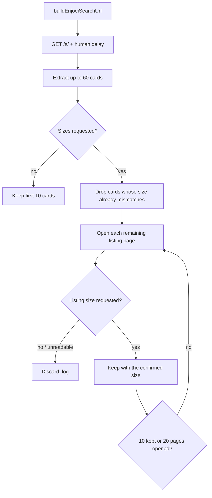

# Enjoei scraping

How `EnjoeiScraper` turns one `search_terms_scraped_products.json_search` row
into at most 10 listings whose size the user actually wears.

Env: [ENV.md](./ENV.md) · Robot overview: [../README.md](../README.md)

Source:

- `src/infrastructure/scraping/marketplaces/enjoei-search-url.ts` — URL + size rules
- `src/infrastructure/scraping/marketplaces/enjoei.scraper.ts` — navigation + DOM scripts

## Why sizes need a second step

Enjoei is a Vue SPA: `/s/` returns a template, and the feed is hydrated from
`https://enjusearch.enjoei.com.br/graphql`. The URL query string is parsed
client-side into filters, so **the size shown on a card is the only evidence we
have that a filter was applied** — and the card is also the thing most likely to
change without notice.

The robot therefore does not trust the search URL on its own. When a search asks
for a size, every listing it keeps has its size read from **its own listing
page** before it is persisted.

## Search URL

```
https://www.enjoei.com.br/s/?q={term}&d={department}&b={brand}&sc={top}&sw={bottom}&ss={foot}
```

Enjoei ships its own abbreviation table in the page markup
(`product-feed[abbr-params-map]`). The ones this robot uses:

| Filter | Param | Value |
|---|---|---|
| `query` | `q` | Free-text search term |
| `department` | `d` | `feminino` · `masculino` · `infantil` |
| `brands` | `b` | Brand slug, kebab-case (`emporio-armani`) |
| `clothes` | `sc` | Top sizes — camisas, camisetas, blusas… |
| `waist` | `sw` | Bottom sizes — calças, bermudas, shorts… |
| `shoes` | `ss` | Footwear sizes |

Multi-value filters repeat the param: `?sc=m&sc=g`, not `?sc=m,g`.

> **`dep` is not the department.** In Enjoei's table `dep` is
> `recommendation_department`, a recommendation/analytics param — it does not
> filter the feed. Sending the gender as `dep` leaves the search unscoped, so a
> women's search also returns men's and kids' listings, whose numeric sizes mean
> something different (a men's waist 40 is not a women's 40). That was the
> original cause of wrong-size results.

### Slug rules

Both department and size values are matched against Enjoei's own option slugs,
and **an unknown slug returns zero results rather than being ignored**. So
normalization has to be exact:

| Requirement | Example |
|---|---|
| Lowercase | `M` → `m` (`sc=M` returns nothing) |
| Unaccented | `Único` → `unico` |
| Numeric sizes as-is | `40` → `40` |

Known clothes slugs: `pp`, `p`, `m`, `g`, `gg`, `xgg`, `unico`, plus numeric
(`36`, `38`, `40`, …). Waist and shoes are numeric. `xg` and `xgg+` do **not**
exist.

`json_search` stores a size list as a comma-separated string (`"M, G"`), which
becomes one repeated param per token.

## Flow per search term



Behavior worth knowing:

- **Cards are extracted before filtering, not after.** Enjoei renders 30 cards
  per page; the robot reads up to 60 and only then caps at 10, so a page whose
  first cards are the wrong size still yields 10 listings.
- **The listing page wins.** If the card says `M` and the listing page says `GG`,
  the listing is discarded.
- **An unreadable card size is not a pass.** Those listings are still opened, so
  a renamed card class costs extra navigations instead of letting wrong sizes
  through.
- **A listing with no readable size is discarded** when a size was requested.
- **Terms with no size** (accessories, `sizeCategory: "none"`) skip listing pages
  entirely — they cost one navigation, as before.
- A human delay (`SCRAPE_DELAY_MIN_MS`…`SCRAPE_DELAY_MAX_MS`) runs before each
  listing page, so a sized term costs roughly 10 extra navigations.

### Caps

| Cap | Value | Why |
|---|---|---|
| Listings per search term | 10 | `MAX_RESULTS_PER_TERM` in the result rows |
| Cards read per search page | 60 | Enough headroom over Enjoei's 30 per page |
| Listing pages opened per search term | 20 | Bounds the cost if the card selector breaks |

## DOM contract

Both scripts are strings passed to `page.evaluate`, pinned by
`tests/unit/enjoei-dom.test.ts` against copies of the live markup.

### Search result card

| Field | Selector |
|---|---|
| Card root | `.c-product-card` |
| URL | `a[href*="/p/"]` (query string stripped, made absolute) |
| Title | `[data-test="div-nome-prod"]`, else `.c-product-card__title`, else the image `alt` |
| Price | `[data-test="div-preco"]` / `.c-product-card__price`, minus `.c-product-card__price-discount` |
| Image | `img[data-test="image-prod"]` / `.c-product-card__img` |
| Size (hint) | `.c-product-card__size` / `.c-product-card__size-wrapper` |

Cards with no listing link, and cards whose only title is a discount badge
(`7%`), are skipped.

### Listing page

| Field | Selector |
|---|---|
| Size | `[data-testid="product-size-value"]` (the "tamanho" info box) |

The value is hydrated client-side — it is not in the server HTML — so the script
polls for up to 8s.

## Persistence

The confirmed size is carried on `ScrapedProduct.size` and written to
`results_search_terms_scraped_products.json_result.metadata.size`.

## When results look wrong

| Symptom | Likely cause |
|---|---|
| Zero listings, `d`/`sc` present | Invalid slug — check case and accents |
| Zero listings for every term | Enjoei defaults `shipping_range` (`sr`) from the caller's IP; a non-Brazil egress can return an empty feed |
| Sizes other than the requested ones | Card size read but listing pages not opened — check `requestedEnjoeiSizeSlugs` for that `json_search` |
| "Stopped confirming Enjoei sizes at the check cap" | Card size selector no longer matches; every candidate needed a listing page |
| Listings kept with a null size | Only happens when the term requested no size |

## Extending

New marketplace: implement `MarketplaceScraperPort` under
`src/infrastructure/scraping/marketplaces/`, register it in `src/main.ts` with
`registerMarketplaceScraper("name", factory)`, and add the marketplace name to
`search_terms_scraped_products.marketplace`. Unknown names mark the term
processed with no result rows.
