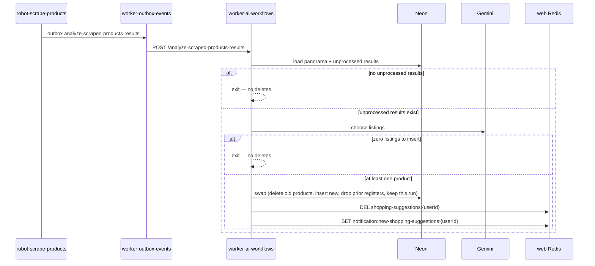

# Analyze Scraped Products Results Workflow

This document describes the **analyze-scraped-products-results** workflow: how it is triggered, what each durable step does, and when `scraped_products` and search/result registers are replaced.

---

## Overview

The workflow picks marketplace listings from unprocessed scrape results and, only when at least one new product is ready, swaps them onto the panorama. Last week’s products stay visible until that swap. This run’s search-term and result rows stay; leftover rows from prior pipeline runs are removed in the same transaction.

**Hosted in:** `worker-ai-workflows`  
**Endpoint:** `POST /analyze-scraped-products-results`  
**Payload:** `{ "wardrobePanoramaId": "<uuid>" }`

A missing or empty `wardrobePanoramaId` fails the workflow without writing or deleting `scraped_products`. Unsigned requests return `401`.

---

## End-to-End Architecture

---

## Triggering

`robot-scrape-products` inserts one PENDING `outbox_events` row per panorama after scraping, then publishes `{ outboxEventId }` to `{WORKER_OUTBOX_EVENTS_URL}/process-outbox-event`. `worker-outbox-events` forwards the stored payload to this endpoint. Catch-up can retry a stuck `PENDING` row.

Do not publish directly to `WORKER_AI_WORKFLOWS_URL` from the robot.

---

## Workflow Execution Flow

**Source:** `src/workflows/analyze-scraped-products-results/workflow.ts`  
**Registration:** `src/workflows/index.ts` under key `analyze-scraped-products-results`

| Step | Name | What it does |
|---|---|---|
| 1 | `load-unprocessed-results` | Load panorama markdown, locale, routine text, and unprocessed `results_search_terms_scraped_products` for the panorama. If none, **exit without deletes**. |
| 2 | `build-prompt` | Build the analyze prompt from panorama, routine, and scrape results. |
| 3 | `execute-prompt` | Call the LLM; persist `llm_interactions`. Parse at most one chosen listing per search term. |
| 4 | — | If the mapped insert list is empty, **exit without deletes**. |
| 5 | `swap-scraped-products` | Single transaction (see below). Skipped unless the insert list is non-empty. |
| 6 | `notify-cache` | `DEL shopping-suggestions:{userId}` and `SET notification:new-shopping-suggestions:{userId}` `{"updatedAt":"<ISO-8601>"}`. Redis failures are logged and do not roll back the swap. |

### Swap transaction

Runs only when at least one new `scraped_products` row is ready to insert:

1. `DELETE` existing `scraped_products` for the panorama
2. `INSERT` the chosen listings (clothing-item `product_type`), setting `result_search_term_scraped_product_id` to the source `results_search_terms_scraped_products.id` (unique 1:1; required on new analyze inserts)
3. `DELETE` leftover `results_search_terms_scraped_products` and `search_terms_scraped_products` whose search-term id is **not** in this run’s unprocessed results
4. `UPDATE` this run’s result rows to `is_processed = true`

**Kept:** the newly inserted `scraped_products`, plus this run’s search-term and result rows.  
**Not deleted outside this swap:** search/result registers. Empty results or a zero-listing LLM choice must not issue a DELETE against those tables.

---

## Data

| Table / key | Role |
|---|---|
| `results_search_terms_scraped_products` (`is_processed = false`) | Input listings for the prompt |
| `search_terms_scraped_products` | Joined for `json_search` and marketplace |
| `scraped_products` | Replaced only when new rows are inserted. Each new row stores `result_search_term_scraped_product_id` pointing at its source result (unique; nullable only for legacy rows the web app still lists) |
| `llm_interactions` | Audit of the analyze prompt |
| `shopping-suggestions:{userId}` | Web list cache — deleted after a successful swap |
| `notification:new-shopping-suggestions:{userId}` | Unread flag — set after a successful swap |

---

## Tests

| File | Coverage |
|---|---|
| `tests/unit/scraped-products-swap.repository.test.ts` | Empty insert list is a no-op; swap keeps this run’s search-term ids; INSERT writes `result_search_term_scraped_product_id`; empty keep-ids skip register deletes |
| `tests/integration/analyze-scraped-products-results.test.ts` | Missing id fails without deletes; zero LLM choices map to no insert; chosen listings carry the result FK; duplicate result ids collapse to one row; load-context never DELETEs |
| `tests/unit/index.test.ts` | Unsigned POST → 401 |
| `tests/unit/shopping-suggestions-cache.test.ts` | Redis key names match the web app |
