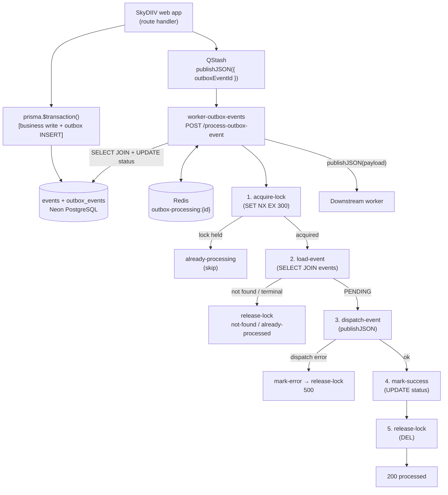
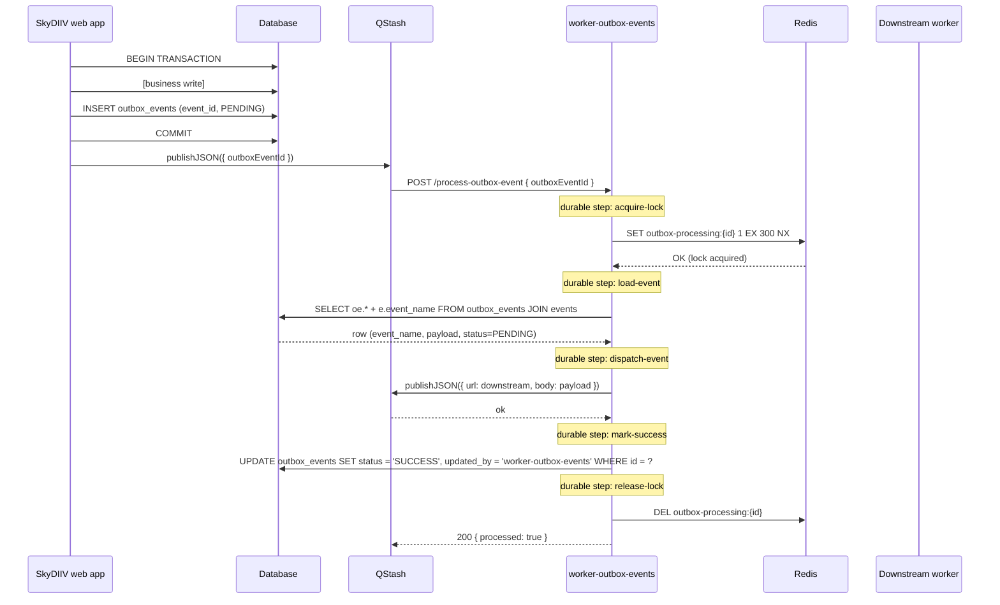

# Process Outbox Event

This document describes the **process-outbox-event** handler end to end: how it is triggered, what each step does, the processing lock strategy, routing by `(event_name, broker_name)` from the `events` catalog, and how it integrates with the SkyDIIV web app and downstream workers.

---

## Overview

The **process-outbox-event** workflow receives an outbox event ID via a signed QStash message, reads the matching row from the `outbox_events` table, dispatches the stored payload to the appropriate downstream worker, and marks the row as `SUCCESS` or `ERROR` when done.

**Hosted in:** `worker-outbox-events` (Upstash Workflow)  
**Endpoint:** `POST /process-outbox-event`  
**Payload:** `{ "outboxEventId": "<uuid>" }`

It is the consumer side of SkyDIIV's Transactional Outbox Pattern. The SkyDIIV web app produces events inside database transactions and publishes their IDs to QStash; this worker ensures each event is dispatched exactly once to the correct downstream worker.

---

## End-to-End Architecture



---

## Triggering

This endpoint is invoked exclusively by QStash. Producers publish a message after inserting an outbox event:

| Producer | When |
|---|---|
| SkyDIIV web app | Immediately after a successful transaction that inserts an outbox event |
| `worker-scheduler` (`catch-up-outbox-events` flow) | On schedule via `POST /schedule/catch-up-outbox-events` — re-enqueues `PENDING` rows older than `OUTBOX_CATCHUP_MIN_AGE_MINUTES` (default 10 min) |

```
# Single event
QStash.publishJSON({ url: "{WORKER_OUTBOX_EVENTS_URL}/process-outbox-event", body: { outboxEventId } })

# Batch (up to 100 per call)
QStash.batchJSON([{ url, body: { outboxEventId } }, ...])
```

The web app and `worker-scheduler` set `WORKER_OUTBOX_EVENTS_URL` to this worker's origin (no path). QStash signs every delivery and retries on `5xx` responses with exponential backoff.

See [CATCH_UP_OUTBOX_EVENTS.md](../../worker-scheduler/docs/CATCH_UP_OUTBOX_EVENTS.md) for the catch-up flow details.

---

## Workflow Execution Flow

**Source:** `src/workflows/process-outbox-event/workflow.ts`  
**Registration:** `src/workflows/index.ts` under key `"process-outbox-event"`

Each step is wrapped in `context.run("<step-name>", …)`, making it a **durable workflow step**. If a step fails, only that step is retried on the next invocation — completed steps are not re-executed. This is critical now that rows are marked `SUCCESS` / `ERROR` instead of deleted: a retry after a successful dispatch must not re-dispatch to the downstream worker.

Inbound QStash signature verification is handled by `@upstash/workflow` (`serveMany`).

### Step: acquire-lock

**Source:** `steps/acquire-lock.ts`

Atomically sets `outbox-processing:{outboxEventId}` in Redis with a **5-minute TTL** only if the key does not already exist (`SET NX EX`).

- Key **already existed** → `200 { processed: false, reason: "already-processing", outboxEventId }`
- Key **set successfully** → lock acquired, workflow continues

---

### Step: load-event

**Source:** `steps/load-event.ts`

Queries `outbox_events` joined with the `events` catalog for the row with the given ID:

```sql
SELECT
  oe.id,
  oe.event_id,
  e.event_name,
  e.broker_name,
  oe.payload,
  oe.status,
  oe.created_at,
  oe.created_by,
  oe.updated_at,
  oe.updated_by
FROM outbox_events oe
INNER JOIN events e ON e.id = oe.event_id
WHERE oe.id = $1
LIMIT 1
```

- Row **not found** → `release-lock` → `200 { processed: false, reason: "not-found", outboxEventId }`
- Row found with status **not** `PENDING` → `release-lock` → `200 { processed: false, reason: "already-processed", outboxEventId, status }`
- Row is `PENDING` → workflow continues to `dispatch-event`

---

### Step: dispatch-event

**Source:** `steps/dispatch-event.ts`

Calls `dispatch(event)` in `src/lib/dispatcher.ts`, which switches on `(event.event_name, event.broker_name)` from the `events` catalog and publishes to the matching broker:

- **QStash routes** — `event.payload` is forwarded verbatim to the downstream worker URL.
- **CF Queues routes** — batch-publishes `{ event: event_name, payload }` via `POST .../messages/batch` for the queue ID env declared on that route (`queueIdEnv`).

This step returns `{ ok: true }` or `{ ok: false, error }` without throwing, so its outcome is cached as a durable step result. A workflow retry after a failed downstream publish does **not** re-run a step that already returned `{ ok: true }`.

- Unknown route or publish error → `mark-error` → `release-lock` → `500 Internal Server Error`

---

### Step: mark-success / mark-error

**Sources:** `steps/mark-success.ts`, `steps/mark-error.ts`

On successful dispatch:

```sql
UPDATE outbox_events
SET status = 'SUCCESS', updated_at = NOW(), updated_by = 'worker-outbox-events'
WHERE id = $1
```

On dispatch failure:

```sql
UPDATE outbox_events
SET status = 'ERROR', updated_at = NOW(), updated_by = 'worker-outbox-events'
WHERE id = $1
```

Both updates set `updated_by = 'worker-outbox-events'`. If `mark-success` throws (e.g. DB unavailable), the workflow retries **only** that step — `dispatch-event` is not re-executed.

---

### Step: release-lock

**Source:** `steps/release-lock.ts`

Deletes `outbox-processing:{outboxEventId}` from Redis.

This step always runs after `mark-success` or `mark-error`, in a separate durable step. The lock stays held while `mark-success` is retrying, preventing concurrent duplicate dispatches.

---

## Payload

```typescript
export type ProcessOutboxEventPayload = {
  outboxEventId: string
}
```

**Example request body:**

```json
{ "outboxEventId": "d4b3c2a1-0000-0000-0000-000000000001" }
```

---

## Routing by Event Name + Broker Name

Routing logic lives in `src/lib/dispatcher.ts`. The `dispatch()` function switches on the composite `(event_name, broker_name)` pair — joined from the `events` catalog (unique on that pair) — and publishes to the matching broker destination.

| `event_name` | `broker_name` | Downstream | How | Secrets |
|---|---|---|---|---|
| `language-changed` | `QStash` | `worker-sync` `POST /sync/language` | QStash `publishJSON` | `WORKER_SYNC_URL` |
| `user-account-created` | `QStash` | `worker-notification` `POST /email--welcome` | QStash `publishJSON` | `WORKER_NOTIFICATION_URL` |
| `generate-search-terms-products-scraping` | `QStash` | `worker-ai-workflows` `POST /generate-search-terms-products-scraping` | QStash `publishJSON` | `WORKER_AI_WORKFLOWS_URL` (origin only) |
| `analyze-scraped-products-results` | `QStash` | `worker-ai-workflows` `POST /analyze-scraped-products-results` | QStash `publishJSON` | `WORKER_AI_WORKFLOWS_URL` (origin only) |
| `scrape-shopping-suggestions` | `CF Queues` | Queue `CF_SCRAPE_SHOPP_SUGG_QUEUE_ID` (e.g. leftover `scrape-shopping-suggestions` rows) | CF Queues HTTP **batch** publish (`POST .../messages/batch`, `{ event, payload }`) | `CF_ACCOUNT_ID`, `CF_SCRAPE_SHOPP_SUGG_QUEUE_ID`, `CF_QUEUES_API_TOKEN` |

Each CF Queues event publishes to its **own** queue ID env var (declared as `queueIdEnv` on the route in `OUTBOX_ROUTES`).

Catalog IDs, names, and brokers must stay in sync with the SkyDIIV web app (`EVENTS` / `BROKER_NAMES` in `app/lib/outbox.ts`). To add a new route, see [Adding a New Event](../README.md#adding-a-new-event) in the main README.

The `scrape-shopping-suggestions` queue exists only to drain leftover rows —
`robot-scrape-products` no longer consumes Cloudflare Queues. It now reads
unprocessed `search_terms_scraped_products` rows directly; see
[ENJOEI_SCRAPING.md](../../robot-scrape-products/docs/ENJOEI_SCRAPING.md).

---

## HTTP Responses

| Situation | Status | Body |
|---|---|---|
| Missing or invalid QStash signature | `401` | `Unauthorized` |
| Invalid or missing `outboxEventId` | `400` | `Bad Request` |
| Event already being processed (Redis lock present) | `200` | `{ processed: false, reason: "already-processing", outboxEventId }` |
| Event not found in database | `200` | `{ processed: false, reason: "not-found", outboxEventId }` |
| Event already processed (`SUCCESS` or `ERROR`) | `200` | `{ processed: false, reason: "already-processed", outboxEventId, status }` |
| Dispatch failed (unknown route or publish error) | `500` | `Internal Server Error` |
| Successfully processed | `200` | `{ processed: true, outboxEventId, eventId, eventName }` |

---

## Idempotency and Processing Lock

### Processing lock

The Redis key `outbox-processing:{outboxEventId}` is used as a short-lived mutex:

| Event | Lock action |
|---|---|
| Processing starts | Atomically acquired via SET NX EX (TTL: 5 min) — skips if key already exists |
| Event not found in DB | Released |
| Event already processed (`SUCCESS` / `ERROR`) | Released |
| Dispatch fails | Released (so QStash retries can proceed) |
| Processing completes successfully | Released |
| Worker crashes before release | Expires automatically after TTL |

### Duplicate delivery handling

QStash may deliver the same message more than once under certain retry conditions. The lock prevents two concurrent invocations from both dispatching the same event. Once the first invocation succeeds and marks the row `SUCCESS`, any subsequent invocation will find either the lock held (if still in progress) or a terminal status (`already-processed` → `200`).

### Status update failure after successful dispatch

If `mark-success` fails, the workflow retries **only** that step. `dispatch-event` already completed and is not re-run. The Redis lock remains held until `release-lock` succeeds, preventing concurrent duplicate dispatches while the status update is retrying.

### Dispatch failure and ERROR status

When dispatch fails, the handler marks the row `ERROR` before returning `500`. On subsequent QStash retries, the handler finds the `ERROR` status and returns `already-processed` (`200`) without re-dispatching. The `catch-up-outbox-events` flow only re-enqueues `PENDING` rows, so `ERROR` events require manual investigation.

---

## Error Handling and Operational Behavior

### Failure modes

| Step | Fatal? | Behavior |
|---|---|---|
| Missing `upstash-signature` | ✅ Fatal | `401` — no further processing |
| Invalid QStash signature | ✅ Fatal | `401` — no further processing |
| Invalid payload | ✅ Fatal | `400` — no lock acquired |
| Redis SET NX failure | ✅ Fatal | Error propagates (unhandled; QStash retries) |
| Outbox event not found | ❌ Non-fatal | `200 not-found` — lock released |
| Outbox event already processed | ❌ Non-fatal | `200 already-processed` — lock released |
| Unknown route | ✅ Fatal | `ERROR` status set; `500` — lock released |
| QStash / CF Queues publish failure | ✅ Fatal | `ERROR` status set; `500` — lock released |
| Database UPDATE failure (SUCCESS) | ✅ Fatal for step | Workflow retries `mark-success` only |
| Database UPDATE failure (ERROR) | ✅ Fatal for step | Workflow retries `mark-error` only |

### Idempotency summary

| Scenario | Outcome |
|---|---|
| Same event delivered twice concurrently | Second invocation skipped (`already-processing`) |
| Same event delivered after successful processing | Row is `SUCCESS` → `already-processed` → `200`, no duplicate dispatch |
| Same event delivered after dispatch failure | Row is `ERROR` → `already-processed` → `200`, no duplicate dispatch |
| Dispatch succeeded but mark-success keeps failing | Workflow retries `mark-success` only; lock held until `release-lock` |
| Worker crashes mid-process | Lock expires after 5 min; QStash retry proceeds normally |

### Logging

All steps emit structured JSON via `createLogger("process-outbox-event")`. Log fields include `outboxEventId`, `eventId`, `eventName`, and `error` where applicable.

---

## Configuration

### Worker secrets

Set via `wrangler secret put <KEY>` (production) or `.dev.vars` (local):

| Variable | Required | Used by |
|---|---|---|
| `QSTASH_CURRENT_SIGNING_KEY` | ✅ | Inbound signature verification |
| `QSTASH_NEXT_SIGNING_KEY` | ✅ | Key rotation |
| `QSTASH_URL` | — | QStash client (optional base URL override) |
| `QSTASH_TOKEN` | ✅ | Downstream dispatch |
| `DATABASE_URL` | ✅ | `outbox_events` SELECT JOIN + UPDATE |
| `WORKER_OUTBOX_EVENTS_URL` | ✅ | Upstash Workflow step callbacks (`serveMany` baseUrl) |
| `UPSTASH_REDIS_REST_URL` | ✅ | Processing lock (or use `REDIS_URL`) |
| `UPSTASH_REDIS_REST_TOKEN` | ✅ | Processing lock (or use `REDIS_URL`) |

Downstream secrets depend on the route: QStash routes need a worker URL; each CF Queues route needs `CF_ACCOUNT_ID`, `CF_QUEUES_API_TOKEN`, and that route's queue ID env (e.g. `CF_SCRAPE_SHOPP_SUGG_QUEUE_ID`). See the [Secrets](../README.md#secrets) section in the main README for the current list.

### Web app secrets (separate deployment)

| Variable | Purpose |
|---|---|
| `WORKER_OUTBOX_EVENTS_URL` | This worker's origin — web app appends `/process-outbox-event` |

---

## Security

- No end-user authentication — internal automation only
- All inbound requests are verified against the QStash signature before any database or Redis access
- `GET /` is the only unsigned endpoint (health check)
- `outboxEventId` comes from the verified QStash payload — the worker never trusts unverified client input
- All secrets are Cloudflare Worker secrets, never in source control

---

## Source File Map

```
apps/worker-outbox-events/
├── src/
│   ├── index.ts                                 # Worker entry; env injection + serveMany routing
│   ├── workflows/
│   │   ├── index.ts                             # serveMany registry
│   │   └── process-outbox-event/
│   │       ├── workflow.ts                      # Durable workflow orchestration
│   │       ├── types.ts                         # Payload + step result types
│   │       └── steps/
│   │           ├── acquire-lock.ts
│   │           ├── load-event.ts
│   │           ├── dispatch-event.ts
│   │           ├── mark-success.ts
│   │           ├── mark-error.ts
│   │           └── release-lock.ts
│   └── lib/
│       ├── logger.ts                            # Structured JSON logger
│       ├── workflow-base-url.ts                 # WORKER_OUTBOX_EVENTS_URL resolver
│       ├── qstash.ts                            # QStash client singleton
│       ├── dispatcher.ts                        # (event_name, broker_name) → downstream routing
│       ├── downstream-urls.ts                   # URL resolvers for QStash downstream workers
│       ├── cloudflare-queues.ts                 # CF Queues HTTP batch publish helper
│       ├── cache/
│       │   ├── redis.ts                         # Upstash REST primitives (exists / set / del)
│       │   └── outbox-processing-cache.ts       # acquire / check / release lock
│       └── db/
│           ├── client.ts                        # postgres.js singleton
│           └── outbox-events.repository.ts      # findById (JOIN events) + updateStatus
```

---

## Testing

Unit tests cover all critical paths:

| Test file | Coverage |
|---|---|
| `tests/unit/index.test.ts` | Worker routing (health check, workflow delegation) |
| `tests/unit/workflows-registry.test.ts` | serveMany registry and baseUrl |
| `tests/unit/workflow-base-url.test.ts` | `WORKER_OUTBOX_EVENTS_URL` resolver |
| `tests/unit/process-outbox-event-workflow.test.ts` | Workflow orchestration and step ordering |
| `tests/unit/process-outbox-event-steps.test.ts` | Individual step implementations |
| `tests/unit/dispatcher.test.ts` | (event_name, broker_name) routing, payload forwarding, unknown route error |
| `tests/unit/cloudflare-queues.test.ts` | CF Queues HTTP publish request shape and error handling |
| `tests/unit/outbox-events-repository.test.ts` | `findById` (found / not-found) and `updateStatus` |
| `tests/unit/downstream-urls.test.ts` | URL composition and missing env var errors |
| `tests/unit/outbox-processing-cache.test.ts` | Lock check, acquire, release |
| `tests/unit/redis.test.ts` | Upstash REST primitives (exists, set with/without TTL, del) |

Run from `apps/worker-outbox-events/`:

```bash
npm test
npm run test:coverage
```

---

## Sequence Diagram



---

## Related Documentation

- [`README.md`](../README.md) — worker setup, deployment, adding new events
- [`apps/worker-sync/README.md`](../../worker-sync/README.md) — language sync workflow reference
- [`apps/worker-notification/docs/EMAIL_WELCOME_WORKFLOW.md`](../../worker-notification/docs/EMAIL_WELCOME_WORKFLOW.md) — welcome email workflow reference
- [`apps/robot-scrape-products/docs/ENJOEI_SCRAPING.md`](../../robot-scrape-products/docs/ENJOEI_SCRAPING.md) — how the scrape robot searches Enjoei and confirms sizes
